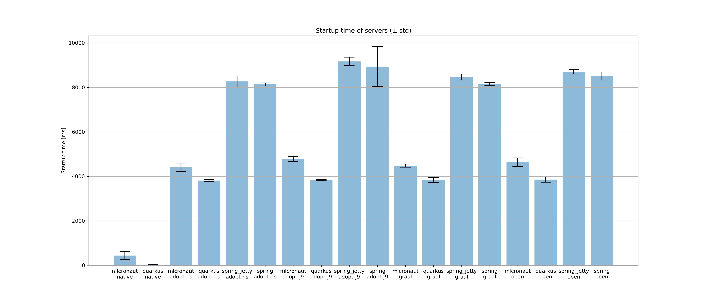
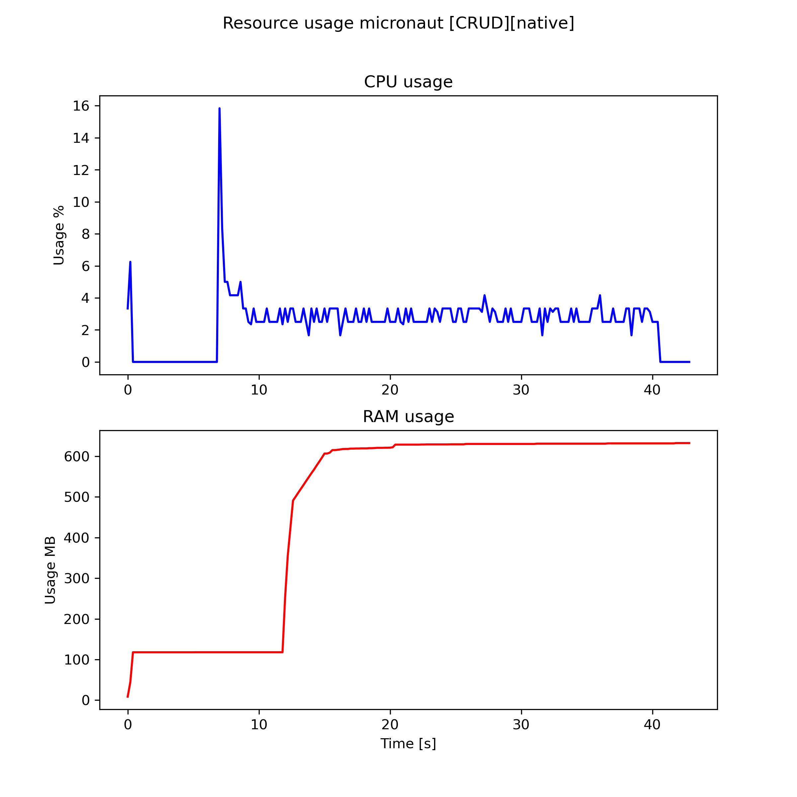
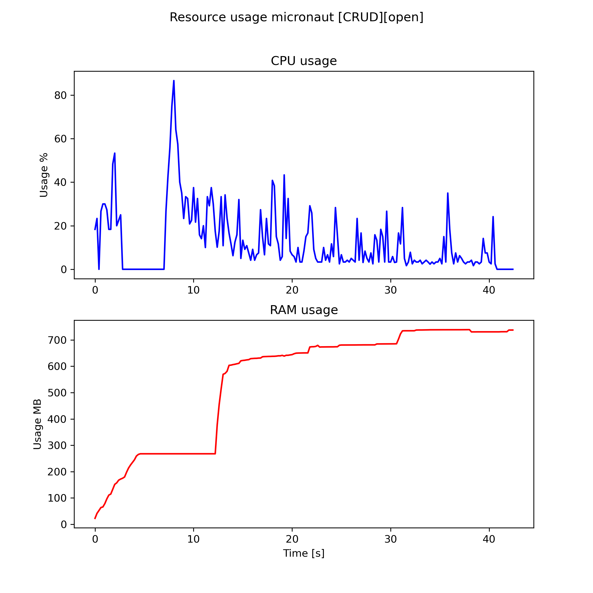
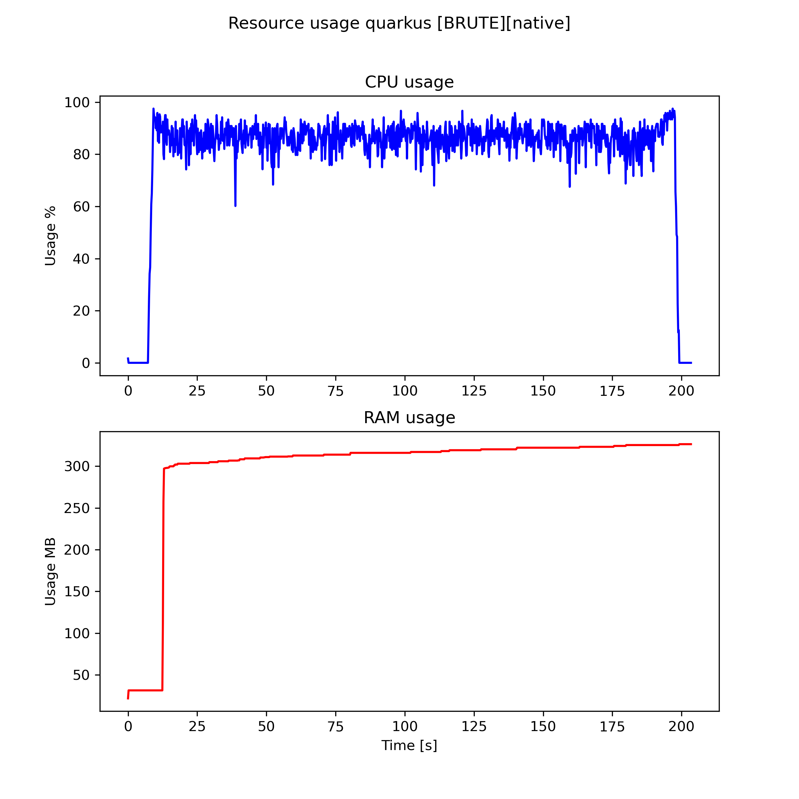
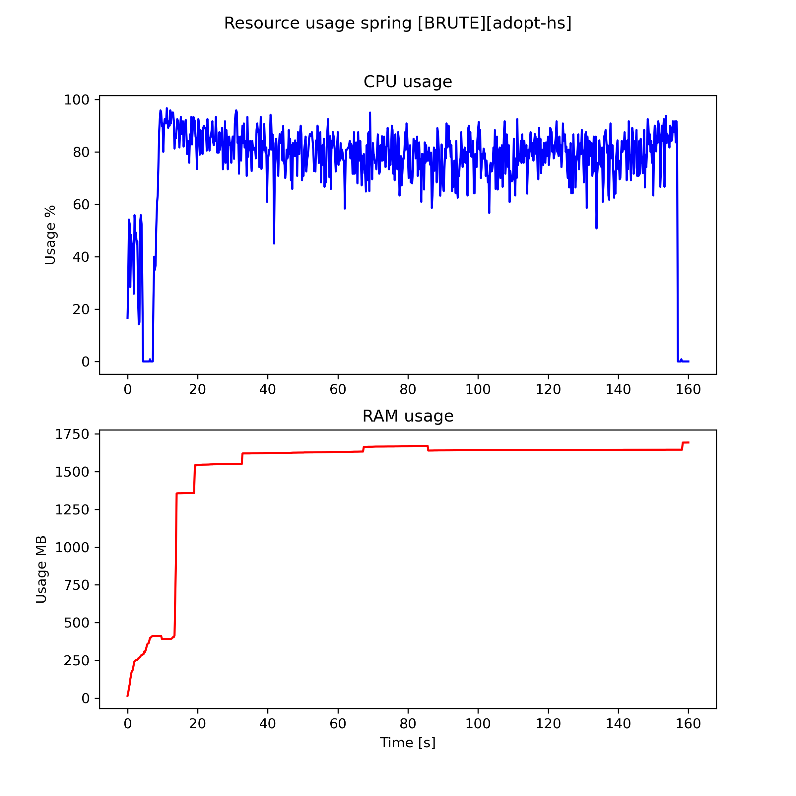
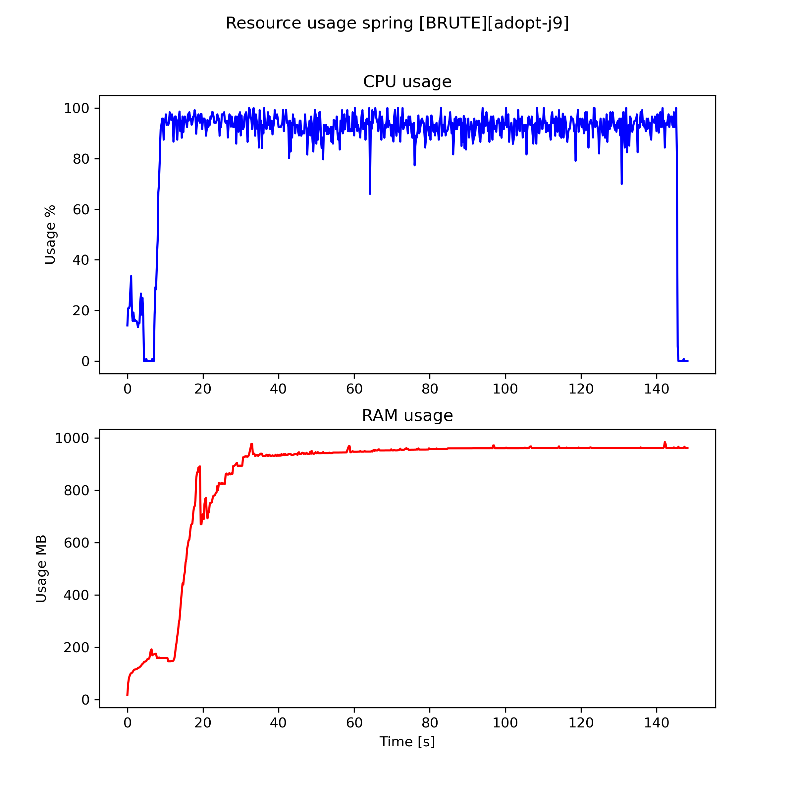
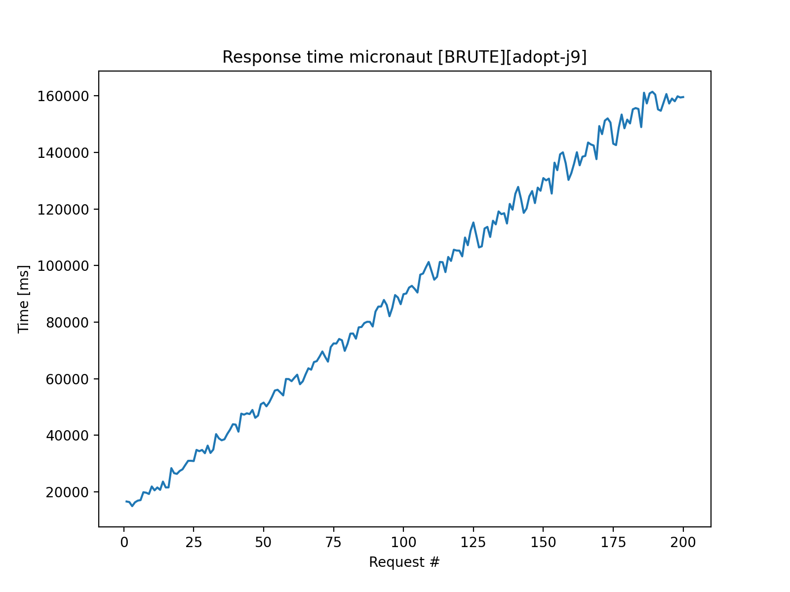
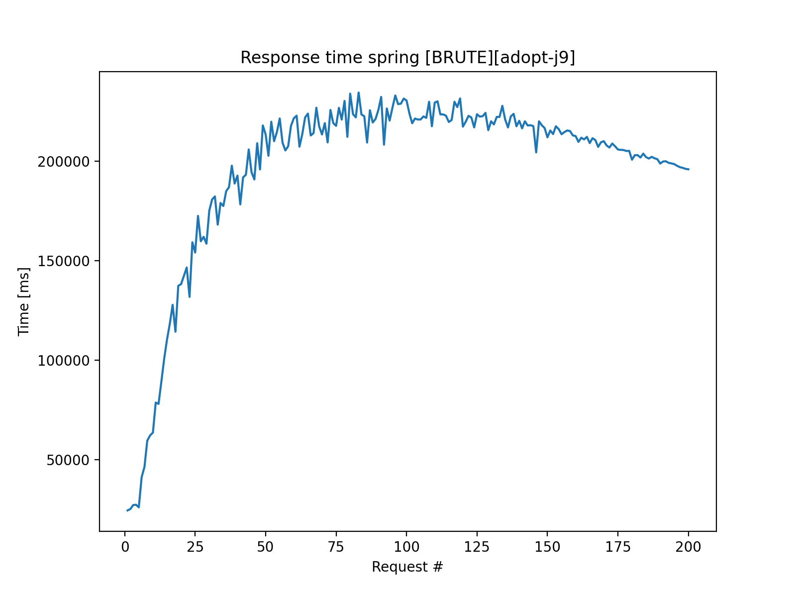
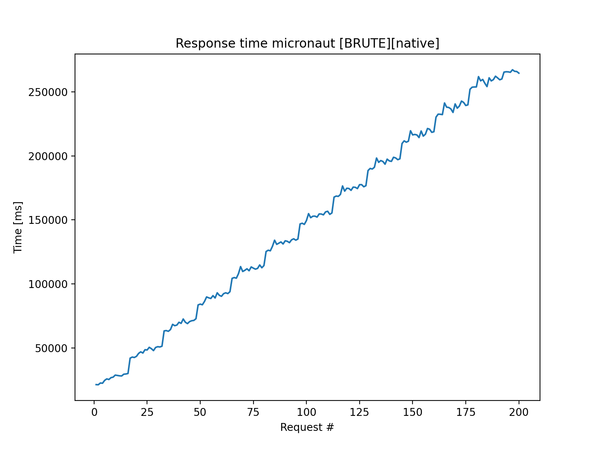

# Results

To generate the images available in [imgs](imgs/) you can use the data provided in [raw](raw/) and [startup](startup/) and the python scripts to plot the results.  
Unzip the archive before running the python scripts.  
These scripts are tailored to the naming convention I have been using throughout the project, so either change the scripts or rename the files to match them.  

Some interesting results are reported below.

- The startup times of native applications are shorter than the JVM-based ones by a lot: Micronaut takes about 100ms, Quarkus around 20ms (but it does not have the CRUD part included), while for the JVM-based, Quarkus and Micronaut both take around 4 seconds while Spring around 8. There is no big difference related to the type of JVM used.  

- The CPU usage with CRUD tests is similar among all JVMs and all applications, the main difference is with respect to Micronaut native that is slightly lower in CPU usage and does not show the same spikes that the JVM-based applications have. It also does not show the initial high spike due to the start up of the JVM.  
With 10'000 threads the results become comparable, except for the initial spike. (In the image the first spike is due to the start of the application, the second spike is when the first request arrives)  

|  |  |
| ------------- | ------------- |
|   |   |  

- The RAM usage with BRUTE tests is reduced with native images to around 1/2 to 1/6 depending on the JVM considered. For the JVM-based Quarkus uses less memory than the other two, while Spring takes second place and Micronaut is last. The difference related to the JVM is relevant as it can reach up to 40%. Interestingly the best results are obtained with OpenJ9, while all the others have similar values. For native images Quarkus takes the lead again with the lowest memory footprint of only 300MB, while Micronaut is last with 600MB. For reference, the JVM-based ones use between 900MB and 2.5GB of memory.  

|  |  |  |
| ------------- | ------------- | ------------- |
|  |  |  |

- Response times with both Quarkus and Micronaut for the BRUTE tests are linear with respect to the request number, in the sense that, given that all requests are received in a short amount of time (relative to the ramp up period), they are served in the order they are received by allocating a limited amount of threads to serve them. This means that requests that are received for last will be kept waiting until there are resources available. On the other hand instead there is Spring which relies heavily on parallelism and tries to compute all requests at the same time. The result is that, while Quarkus and Micronaut output responses at regular times, Spring instead outputs the responses all at the same time at the end (which is comparable to the time when Quarkus and Micronaut output their last response).
This behavior shows the different approaches of the frameworks that have both positive and negative effects, depending on the type of requests that we are serving. The behavior could also be changed by configuring the applications to use a pool with more or less threads.  

|  |  |
| ------------- | ------------- |
|   |   |

- Response time for the BRUTE test in native applications is 20 to 30% higher and this is probably due to the fact that the code that is run by the JVM is more optimized, while the native code lacks all the optimizations provided by the JVM that are lost during the conversion (it's specified in the GraalVM documentation that at the current time, this is in fact the case). This may be a major drawback in some applications and must be taken into account. At the same time, however, with time, native images may include other types of optimizations, so this point should be reconsidered at a later time.

|  |  |
| ------------- | ------------- |
|  |  |
